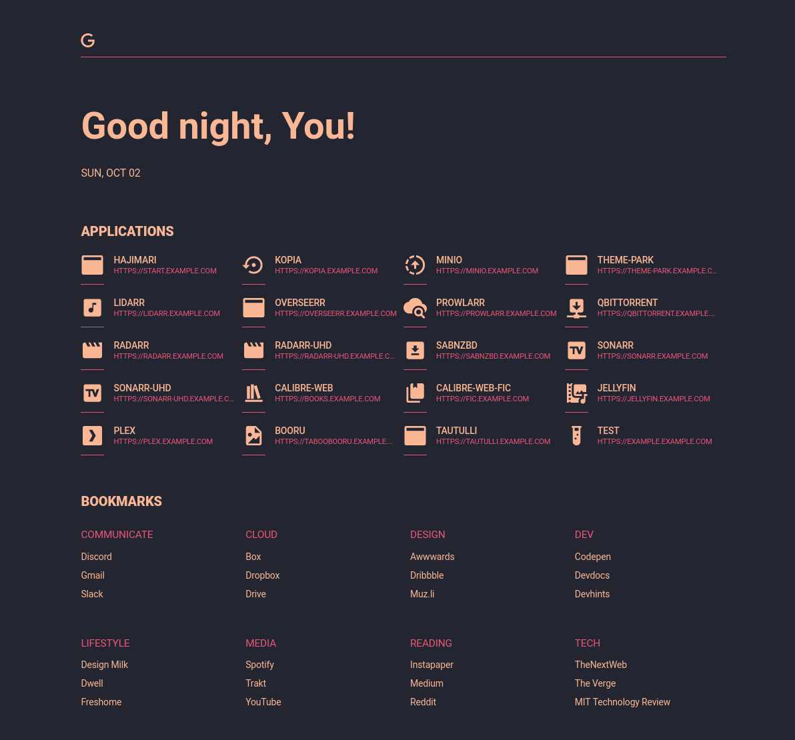
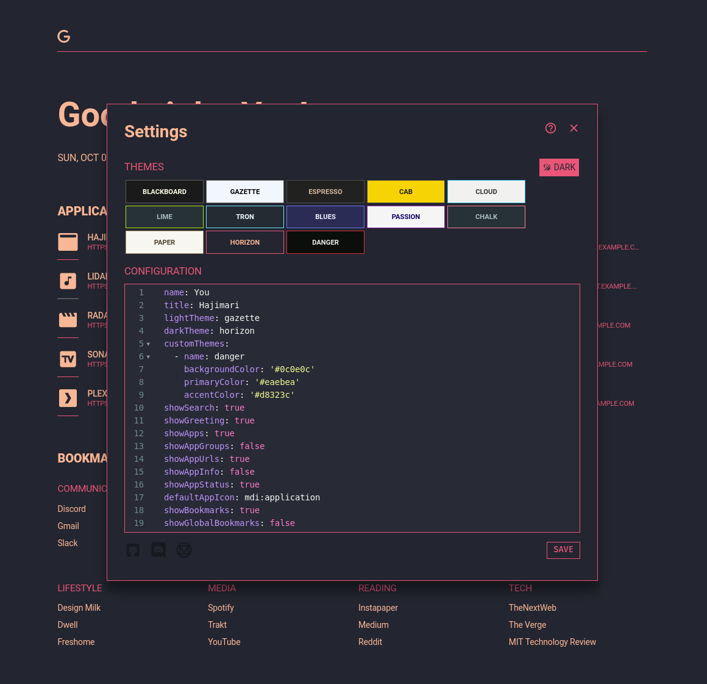
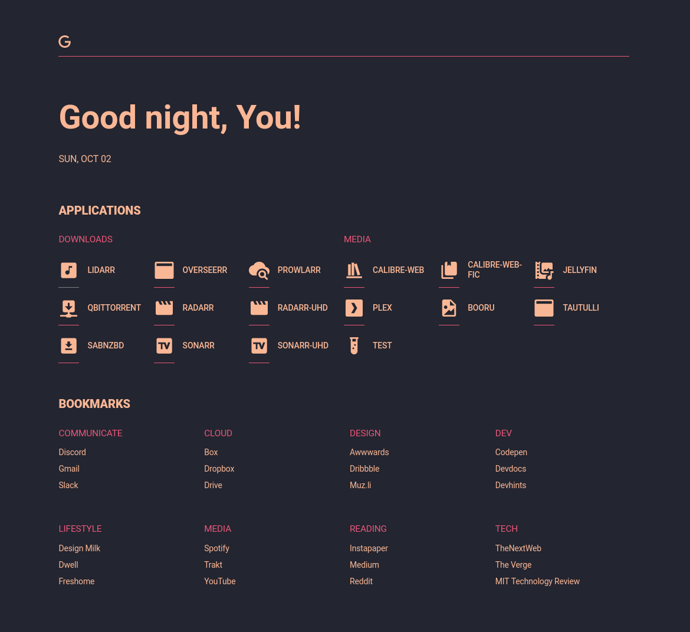

# Hajimari 🌅
_...The beginning of a pleasant experience_

<br />

[](https://discord.gg/HWGZSWJsA8)
[](https://go.dev/)
[](https://github.com/toboshii/hajimari/actions/workflows/ci.yaml)

---

## Hajiwhatsi?

Hajimari is a simplistically beautiful startpage designed to be the entrypoint for your self-hosted Kubernetes cluster.







## Features

- Web and app search with customizable search providers
- Dynamically list apps discovered from Kubernetes Ingresses or Custom Resources
- Display replica status for ingress endpoints
- Support for non-Kubernetes apps via custom apps config
- Customizable list of bookmarks
- Selectable themes and custom theme support
- Automatic light/dark mode
- Custom configuration overrides per user/browser
- Multiple instance support

## Installation

### Helm

`helm repo add hajimari https://hajimari.io`

`helm repo update`

`helm install hajimari hajimari/hajimari`

[Helm docs](charts/hajimari)

### Locally

Clone the repo and run the following command to generate the `hajimari` binary:

```bash
make deps
make build
```

Or for local development with hot reload:

```bash
make deps
make dev
```

You will need to have `go` 1.19 and `node` 18 installed.

Hajimari will need access to a kubeconfig file for a service account with [access to ingress and endpoint slice](charts/hajimari/templates/rbac.yaml) objects.

## Usage

### Ingresses

Hajimari looks for specific annotations on [Ingresses](https://kubernetes.io/docs/concepts/services-networking/ingress/).

- Add the following annotations to your ingresses in order for it to be discovered by Hajimari:

| Annotation                | Description                                                                                                                                          | Required |
|---------------------------|------------------------------------------------------------------------------------------------------------------------------------------------------|----------|
| `hajimari.io/enable`      | Add this with value `true` to the ingress of the app you want to show in Hajimari                                                                    | `true`   |
| `hajimari.io/icon`        | Icon name from [MDI icons](https://materialdesignicons.com/)                                                                                         | `false`  |
| `hajimari.io/appName`     | A custom name for your application. Use if you don't want to use the name of the ingress                                                             | `false`  |
| `hajimari.io/group`       | A custom group name. Use if you want the application to show in a different group than the namespace it is running in                                | `false`  |
| `hajimari.io/instance`    | A comma separated list of name/s of the Hajimari instance/s where you want this application to appear. Use when you have multiple Hajimari instances | `false`  |
| `hajimari.io/url`         | A URL for the Hajimari app (This will override the ingress URL). It MUST begin with a scheme i.e., `http://` or `https://`                           | `false`  |
| `hajimari.io/targetBlank` | Determines if links should open in new tabs/windows                                                                                                  | `false`  |
| `hajimari.io/info`        | A short description of the Hajimari app                                                                                                              | `false`  |

### Config

Hajimari supports the following configuration options that can be modified by either ConfigMap or `values.yaml` if you are using Helm

|         Field         |                                          Description                                           |              Default               | Type                                  |
|:---------------------:|:----------------------------------------------------------------------------------------------:|:----------------------------------:|---------------------------------------|
|     instanceName      |                                 Name of the Hajimari instance                                  |                 ""                 | string                                |
|     defaultEnable     |             Set to true to expose all ingresses in selected namespaces by default              |               false                | bool                                  |
|   namespaceSelector   | Namespace selector which uses a combination of hardcoded namespaces as well as label selectors |             any: true              | NamespaceSelector                     |
|         name          |                                  Name to use in the greeting                                   |               "You"                | string                                |
|         title         |                            Browser title for this Hajimari instance                            |             "Hajimari"             | string                                |
|      lightTheme       |                       Theme to use when the browser prefers light themes                       |             "gazette"              | string                                |
|       darkTheme       |                       Theme to use when the brwoser prefers dark themes                        |             "horizon"              | string                                |
|     customThemes      |                                    A list of custom themes                                     |                 []                 | \[\][Theme](#theme)                   |
|     showGreeting      |                              Toggle showing the greeting and date                              |                true                | bool                                  |
|     showAppGroups     |                           Toggle grouping apps by group (namespaces)                           |                true                | bool                                  |
|      showAppUrls      |                                   Toggle displaying app URLs                                   |                true                | bool                                  |
|      showAppInfo      |                                    Toggle showing app info                                     |               false                | bool                                  |
|     showAppStatus     |                          Toggle showing app replica status indicators                          |                true                | bool                                  |
|  showBookmarkGroups   |                               Toggle grouping bookmarks by group                               |                true                | bool                                  |
|  showGlobalBookmarks  |                      Toggle showing global bookmarks on custom startpages                      |               false                | bool                                  |
|   alwaysTargetBlank   |                 Set to true to open apps/bookmarks in a new window by default                  |               false                | bool                                  |
| defaultSearchProvider |                   `name` of the configured search provider to use as default                   |              "Google"              | string                                |
|    searchProviders    |                               A list of custom search providers                                | [[...](#default-search-providers)] | \[\][SearchProvider](#searchprovider) |
|      customApps       |                      A list of custom apps to add to the discovered apps                       |                 []                 | \[\][AppGroup](#appgroup)             |
|    globalBookmarks    |                                A list of bookmark groups to add                                |                 []                 | \[\][BookmarkGroup](#bookmarkgroup)   |

### HajimariApp objects

It also possible to define Apps via Kubernetes [Custom Resources](https://kubernetes.io/docs/concepts/extend-kubernetes/api-extension/custom-resources/) for those using Istio's [Virtual Services](https://istio.io/latest/docs/reference/config/networking/virtual-service/), Traefik's [IngressRoutes](https://doc.traefik.io/traefik/routing/providers/kubernetes-crd/) or other solutions, which does not reply on native Ingress objects:

```yaml
apiVersion: hajimari.io/v1alpha1
kind: Application
metadata:
  name: hajimari-issues
spec:
  name: Hajimari Issues
  group: info
  icon: simple-icons:github
  url: https://github.com/toboshii/hajimari/issues
  info: Submit issue to this project
  targetBlank: true
```

#### NamespaceSelector

It is a selector for selecting namespaces either selecting all namespaces or a list of namespaces, or filtering namespaces through labels.

|     Field     |                                          Description                                          | Default | Type                                                                                         |
|:-------------:|:---------------------------------------------------------------------------------------------:|:-------:|----------------------------------------------------------------------------------------------|
|      any      | Boolean describing whether all namespaces are selected in contrast to a list restricting them |  false  | bool                                                                                         |
| labelSelector |                Filter namespaces based on kubernetes metav1.LabelSelector type                |  null   | [metav1.LabelSelector](https://godoc.org/k8s.io/apimachinery/pkg/apis/meta/v1#LabelSelector) |
|  matchNames   |                                    List of namespace names                                    |  null   | []string                                                                                     |

*Note:* If you specify both `labelSelector` and `matchNames`, Hajimari will take a union of all namespaces matched and use them.

#### Theme

If you want to add custom themes you can provide a list of custom theme atrributes.

| Field           | Description                | Type   |
|-----------------|----------------------------|--------|
| name            | Name of the theme          | String |
| backgroundColor | Background color hex value | String |
| primaryColor    | Primary color hex value    | String |
| accentColor     | Accent color hex value     | String |

#### SearchProvider

If you want to add custom search providers you can provide a list of custom providers to override the defaults.

| Field     | Description                                                                  | Type   |
|-----------|------------------------------------------------------------------------------|--------|
| name      | Name of the search provider                                                  | String |
| token     | Short token used to activate this provider in the search bar                 | String |
| icon      | Icon name or URL to use for this search provider                             | String |
| searchUrl | URL to use for searches, the token `{query}` will be replaced with the query | String |
| url       | URL to use when only `token` is entered in search bar                        | String |

##### Default Search Providers

`searchProviders` defaults to the following values:

```yaml
searchProviders:
  - name: Google
    token: g
    icon: simple-icons:google
    searchUrl: https://www.google.com/search?q={query}
    url: https://www.google.com
  - name: DuckDuckGo
    token: d
    icon: simple-icons:duckduckgo
    searchUrl: https://duckduckgo.com/?q={query}
    url: https://duckduckgo.com
  - name: IMDB
    token: i
    icon: simple-icons:imdb
    searchUrl: https://www.imdb.com/find?q={query}
    url: https://www.imdb.com
  - name: Reddit
    token: r
    icon: simple-icons:reddit
    searchUrl: https://www.reddit.com/search?q={query}
    url: https://www.reddit.com
  - name: YouTube
    token: 'y'
    icon: simple-icons:youtube
    searchUrl: https://www.youtube.com/results?search_query={query}
    url: https://www.youtube.com
  - name: Spotify
    token: s
    icon: simple-icons:spotify
    searchUrl: https://open.spotify.com/search/{query}
    url: https://open.spotify.com
```

#### AppGroup

If you want to add any apps that are not exposed through ingresses or are external to the cluster, you can use the custom apps feature. You can pass a list of custom apps inside the config.

| Field | Description                   | Type            |
|-------|-------------------------------|-----------------|
| group | Name of the group (namespace) | String          |
| apps  | A list of custom apps         | \[\][App](#app) |

##### App

Custom apps can be added by configuring a list of apps under an app group.

| Field       | Description                         | Type   |
|-------------|-------------------------------------|--------|
| name        | Name of the custom app              | String |
| icon        | Icon name or URL for the custom app | String |
| url         | URL of the custom app               | String |
| info        | Short description of the custom app | String |
| targetBlank | Open app in a new window/tab        | Bool   |

#### BookmarkGroup

Bookmark groups can be added by creating a list of groups and associated bookmarks.

| Field     | Description                | Type                      |
|-----------|----------------------------|---------------------------|
| group     | Name of the bookmark group | String                    |
| bookmarks | Array of bookmarks         | \[\][Bookmark](#bookmark) |

Bookmarks can be added by configuring a list of bookmarks under a group.

##### Bookmark

| Field       | Description                       | Type   |
|-------------|-----------------------------------|--------|
| name        | Name of the bookmark              | String |
| icon        | Icon name or URL for the bookmark | String |
| url         | URL of the bookmark               | String |
| targetBlank | Open bookmark in a new window/tab | Bool   |

### Search

The search bar has a few functionalities:
* If a query starts with `/` (similiar to vi/vim's search) it will filter the applications in real time allowing you to quickly find the app you're looking for.
* If a query starts with `@<token>` and matches a token configured for a `searchProvider` then the request will be forwarded to the configured `searchUrl` with `{query}` replaced with the portion of the query after the token.
* If no query is provided following the token or there is no `searchUrl` configured for the provider, then the user will be redirected to the contents of `url`. This allows you to use tokens to quickly access external sites.  

### Icons

Any `icon` field can be either an [Iconify](https://iconify.design/) supported icon (ex: `mdi:kubernetes`, `simple-icons:google`) or a URL to an image.

### Custom startpage setup

1. Open Hajimari in your browser, click the hamburger menu in the lower lefthand corner.
2. Modify the options you wish to change in the built-in YAML editor.
3. Click `Save` and you'll be redirected to your new custom page with a random ID on the URL. Set this page as your homepage/new tab page. For the best experience in Firefox I recommend the [New Tab Override](https://addons.mozilla.org/en-US/firefox/addon/new-tab-override/) extension; for Chrome [Custom New Tab URL](https://chrome.google.com/webstore/detail/custom-new-tab-url/mmjbdbjnoablegbkcklggeknkfcjkjia).
4. You can make further modifications to this page at anytime under the hamburger menu.

Please note there is no authentication. You might want to run this behind ingress with access restrictions.

## Contributing

Pull requests are welcome. For major changes, please open an issue first to discuss what you would like to change.

Please make sure to update tests as appropriate.

Run `make help` for information on linting, tests, etc.

## About
### Why Hajimari?

Hajimari (始まり) is Japanese for `beginnings`. Hajimari's original intended purpose is to be used as a browser startpage, so the name seemed fitting as it's the beginning of all new tabs/windows :)

## Thank you / dependencies

- [SUI](https://github.com/jeroenpardon/sui) For the great startpage template
- [Forecastle](https://github.com/stakater/Forecastle) Ideas for integrating k8s ingress

## License

[Apache-2.0](https://choosealicense.com/licenses/apache-2.0/)
